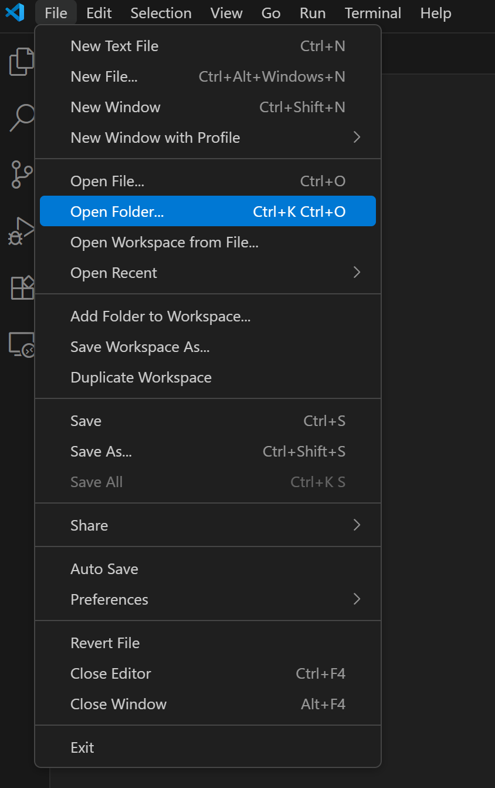
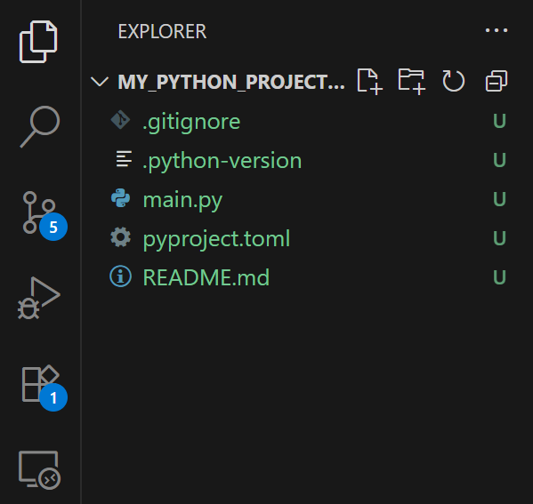
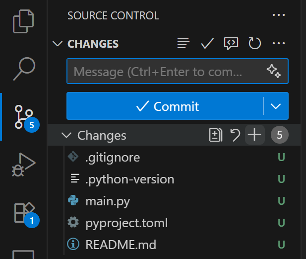
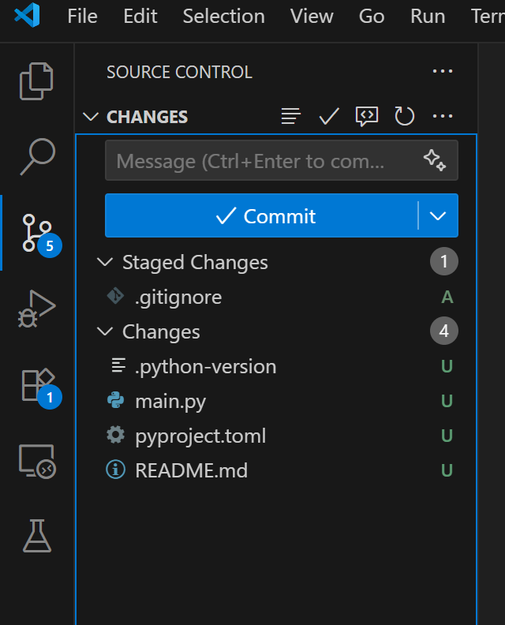
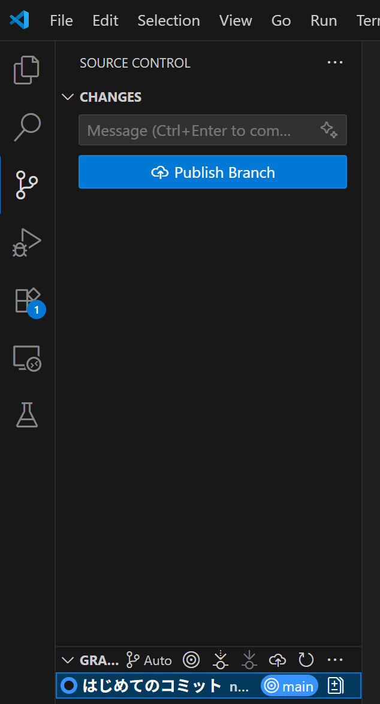
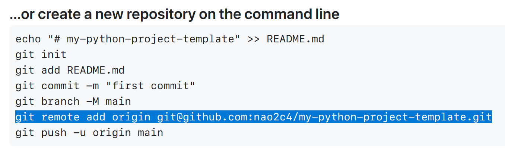
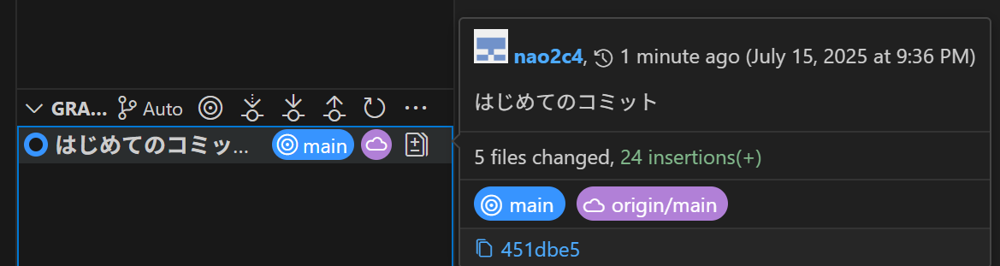

# プロジェクトの始め方

このドキュメントでは、プロジェクトを始めるための基本的な手順を説明します。

## 1. VS Code で作業ディレクトリを開く

まず、プログラムを記録するための作業ディレクトリを VS Code で開きます。

エクスプローラー等で、作業ディレクトリを作成しておきます。
以下の画像のように、VSCode を開き、作業ディレクトリを開きます。



## 2. uv で Python プロジェクトを作成する

次に、uv を使用して Python プロジェクトを作成します。

Ctrl + J を押すと、画面下にターミナルが表示されます。

ターミナルで以下のコマンドを実行します。

```bash
uv init
```

コマンドが成功すると、以下のようなメッセージが表示されます。

```
Initialized project `{ディレクトリ名}`
```

VS Code のエクスプローラーを見ると、画像のようにファイルが作られています。



## 3. Git にコミット

プロジェクトの初期状態を Git にコミットします。

VS Code の左側のサイドバーにあるソース管理アイコンをクリックします。

画像のように、変更されたファイルが表示されます。



変更されたファイルの "+" アイコンをクリックして、ステージングします。



変更された全ファイルをステージングしたら、コミットメッセージを入力して、チェックマークのアイコンをクリックします。



これで、プロジェクトの初期状態が Git にコミットされました。
下側のグラフに、コミットが追加されていることが確認できます。

## 4. GitHub にプッシュ

次に、GitHub にプロジェクトをプッシュします。

GitHub のリポジトリを作成し、リモートリポジトリの URL をコピーします。
リモートリポジトリの URL を登録するために、以下のコマンドをターミナルで実行します。

```bash
git remote add origin {リモートリポジトリのURL}
```

リモートリポジトリの URL は GitHub のリポジトリページで確認できます。



雲印のアイコンをクリックして、リモートリポジトリにプッシュします。
赤い雲印のアイコンが表示されていれば、プッシュが成功しています。


